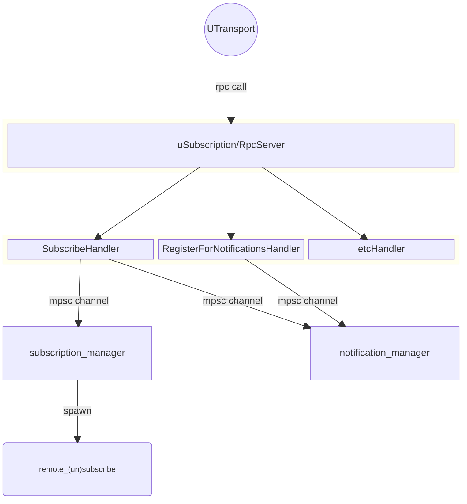
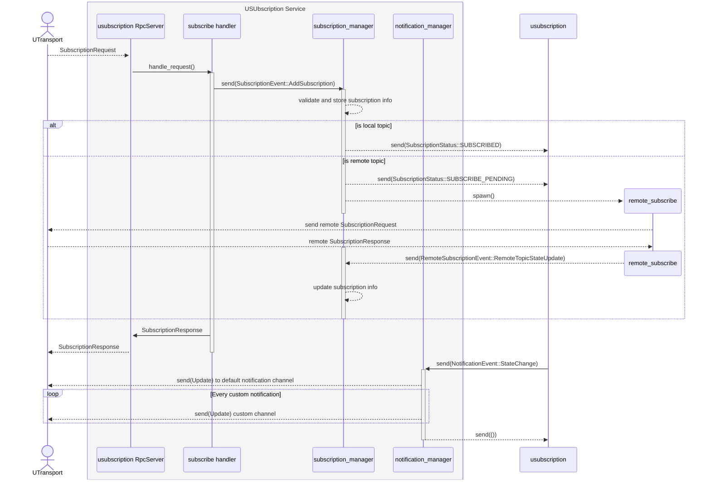

# up-subscription-rust

uSubscription service written in Rust

## Implementation Status

This codebase is approaching beta state, mirroring progress in up-spec and up-rust

- [x] extend test coverage, especially for the backend subscription management and notification handler
- [x] make size of command channels bounded and (probably) configurable
- [x] handling of startup and proper shutdown for usubscription service
- [x] look into recent up-rust changes around Rpc and UTransport implementations, and whether we can  use something from there
- [x] add github CI pipeline setup
- [x] create a usubscription-cli module, a simple command-line frontend for running up-subscription
- [x] set up a devcontainer
- [x] feed back learnings and clarifications into up-spec usubscription documentation
- [x] implement subscription expiry
- [ ] implement any changes necessary to align with update/re-write of uSubscription specification
- [ ] create a little demo application for interacting with up-subscription
- [ ] tests for subscriber persistency

## Getting Started

### Working with the library

`up-subscription-rust` is pluggable regarding which `uTransport` and `RpcClient` implementation it uses; you can provide any implementation of these up-rust traits for up-subscription to work with.

At the moment, running up-subscription involves the following steps:

1. Instantiate a UTransport implementation you want to use
   - the UTransport is used for sending of subscription change notifications, as well as for returning service responses via the command listeners
2. Call `USubscriptionServce::run()`, providing the UTransport implementation
   - this requires a `USubscriptionConfiguration` object, which carries the UTransport references as well as any other available USubscription configuration options
   - this directly spawns two tasks for managing subscriptions and dealing with the sending of subscription update notifications, respectively
   - it returns a `USubscriptionStopper` object that can be used to shut the USusbcription service down in an orderly manner
3. Vóila, you should have a working usubscription service up and running

### Using the up-subscription-cli frontend

For a batteries-included approach to running up-subscription-rust, the `up-subscription-cli` module provides a command line frontend for running the USubscription service. `up-subscription-cli` offers the customary range of settings and features, to get usage information run

```console
up-subscription-cli -h
```

Note: After `cargo build`ing the up-subscription-rust projects, the `up-subscription-cli` build artifact is usually located in the `./target/debug/` folder in your workspace. Alternatively, you can directly do `cargo run -- <parameters>` from you workspace root - for example, to build and run `up-subscription-cli` with zenoh transport and giving verbose output, use

```console
cargo run --features zenoh -- -t zenoh -a usubscription.local -v
```

`up-subscription-cli` can be used with any uProtocol rust transport implementation - the available options are controlled as cargo features, refer to the definitions in the `[features]` section of up-subscription-cli `Cargo.toml`. Currently supported are `local` (minimal [up-rust](https://github.com/eclipse-uprotocol/up-rust) utility implementation, for testing and development purposes), [`zenoh`](https://github.com/eclipse-uprotocol/up-transport-zenoh-rust) and [`mqtt`](https://github.com/eclipse-uprotocol/up-transport-mqtt5-rust) transports.

### Running with docker

The `up-subscription-cli` also can be built and run using docker and docker-compose. The top-level `Dockerfile` and `docker-compose.yaml` are provided for that purpose. `up-subscription-cli` can be provided with configuration parameters both via cli arguments, as well as environment variables. For reference on these, please refer to `docker-compose.yaml`. Please note that this configuration is provided mainly for demonstration purposes - for a production deployment, you want to revisit e.g. the network settings used by the container.

To build the container, in the project root run

```console
docker build -t up-subscription .
```

To run (and auto-build if required) the container, in the project root run

```console
docker-compose up
```

## Design

USubscription service implementation is a three-tiered design, with the following layers:

- UTransport listeners, which link USubscription service methods to a specific transport implementation
- USubscription service, which is called from the listeners and performs input validation as well as high-level business logic orchestration; it acts as a frontend for
- subscription and notification manager actors, which contain the book-keeping and core business logic around subscriptions and notifications

The overall usubscription service implementation comprises the following building blocks:



$~$

A basic interaction flow for a client requesting a subscription is illustrated below:


